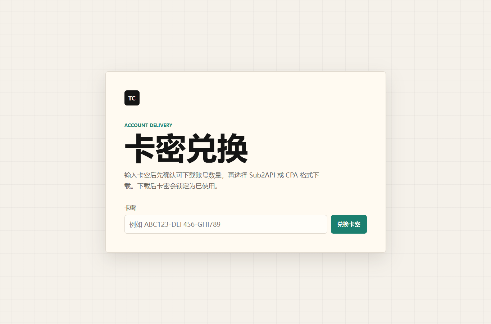
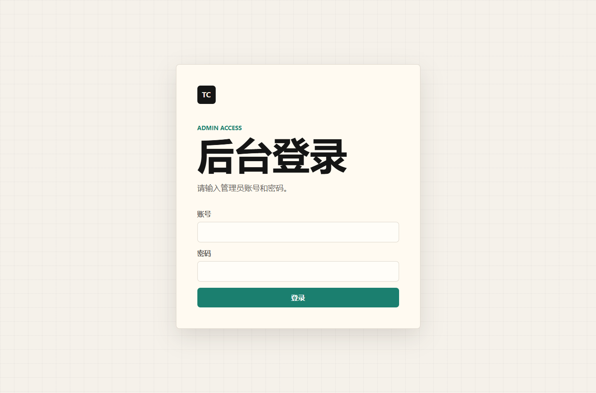
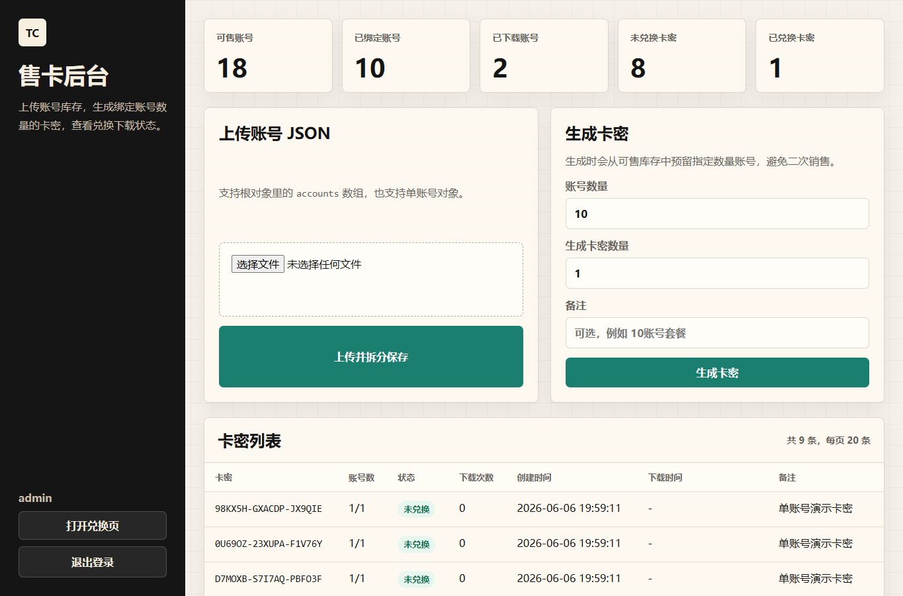

# Team Card Web

Python + FastAPI + SQLite 售卡网站。

## 界面预览

### 兑换页



### 后台登录



### 售卡后台



## 功能

- 后台上传账号 JSON，自动读取 `accounts` 数组并按单账号拆分保存。
- 后台按账号 `name` 显示库存。
- 生成指定账号数量的卡密，生成时预留库存，避免同一账号被重复销售。
- 用户输入卡密后下载一个 JSON 文件，文件内包含该卡密对应数量的账号。
- 下载成功后卡密和账号都标记为已下载，卡密不能二次兑换。

## Docker 部署

```powershell
docker compose up -d --build
```

部署前请先修改 `.env` 里的：

- `ADMIN_USERNAME`
- `ADMIN_PASSWORD`
- `ADMIN_SECRET_KEY`

打开：

- 兑换页：http://服务器IP:8001/
- 后台：http://服务器IP:8001/admin

数据会持久化到宿主机 `./data/cards.db`。容器和应用时间都使用上海时区 `Asia/Shanghai`。

常用命令：

```powershell
docker compose logs -f
docker compose restart
docker compose down
```

## 本地启动

```powershell
pip install -r requirements.txt
uvicorn app.main:app --reload --host 127.0.0.1 --port 8000
```

打开：

- 兑换页：http://127.0.0.1:8000/
- 后台：http://127.0.0.1:8000/admin

SQLite 数据库会自动创建在 `data/cards.db`。

本地和 Docker 都会读取 `.env`。如果要重建配置模板，可以参考 `.env.example`。
